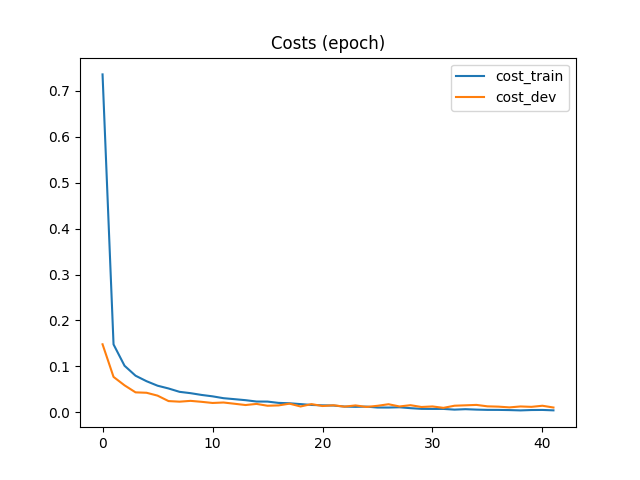
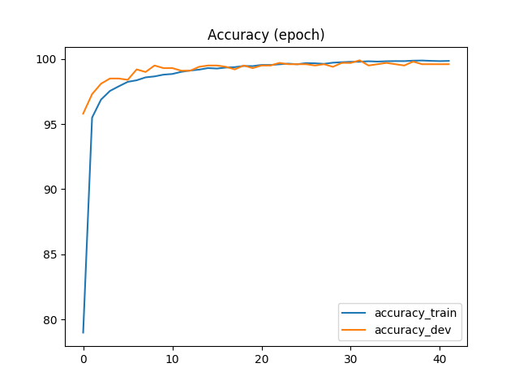

# ConvNet in Tensorflow Core

I implemented a CNN deep learning model using Tensorflow Core and trained it from scratch using MNIST digits on Amazon Web Services. The dataset is taken from here: [Kaggle MNIST competition](https://www.kaggle.com/c/digit-recognizer/data)

## Folder structure

* ``cnn_tf.py``         - the main file with CNN implemented
* ``datahandler.py``    - a class to handle MNIST data and feed minibatches into the neural network
* ``params_mode_cnn.json``   - parameters for training

## Performance on MNIST dataset

After training for appoximately 40 epochs, achieved accuracy **99.14% on a training dataset**. Ranked **top 22% on the leaderboard** on Kaggle (as of 29th of Nov 2017).

> **Results**
> - Train accuracy:  99.86%
> - Dev accuracy:    99.70%
> - Test accuracy:   99.14%

> **Layers in the network**
> - Conv2D, 5x5, 32 filters
> - MaxPool, 2x2
> - Conv2D, 3x3, 64 filters
> - MaxPool, 2x2
> - Conv2D, 3x3, 128 layers
> - MaxPool, 2x2
> - FC, 1152 units
> - Dropout, 0.5
> - FC, 10 (output)

